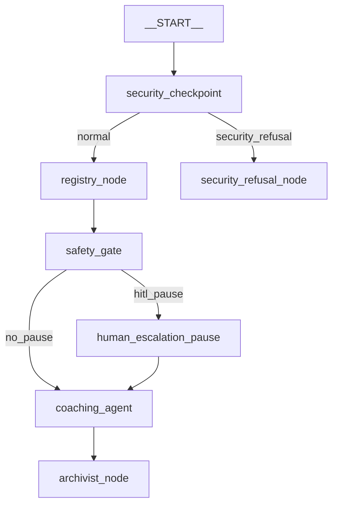
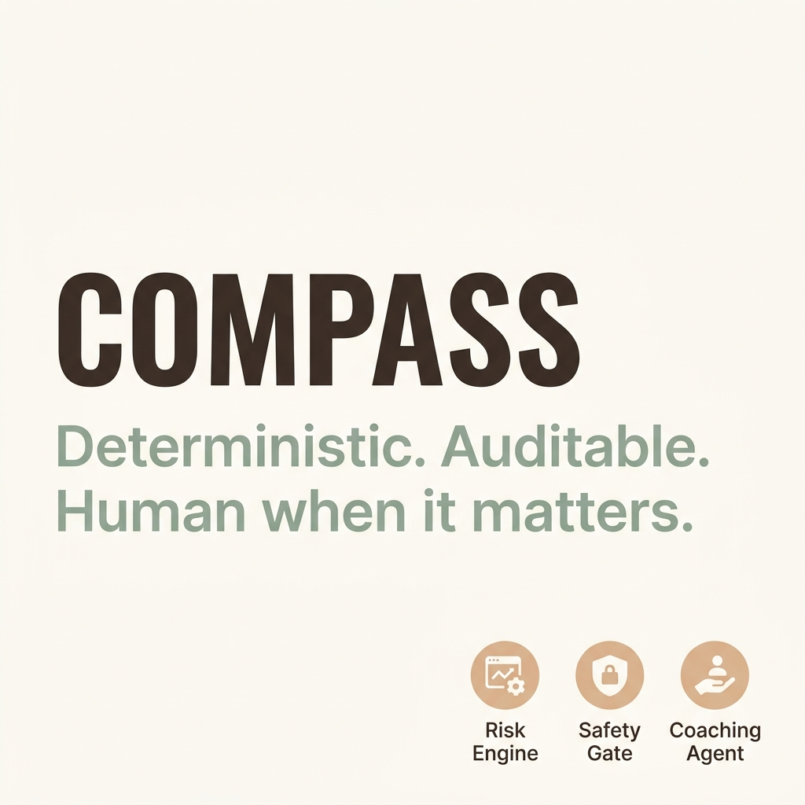
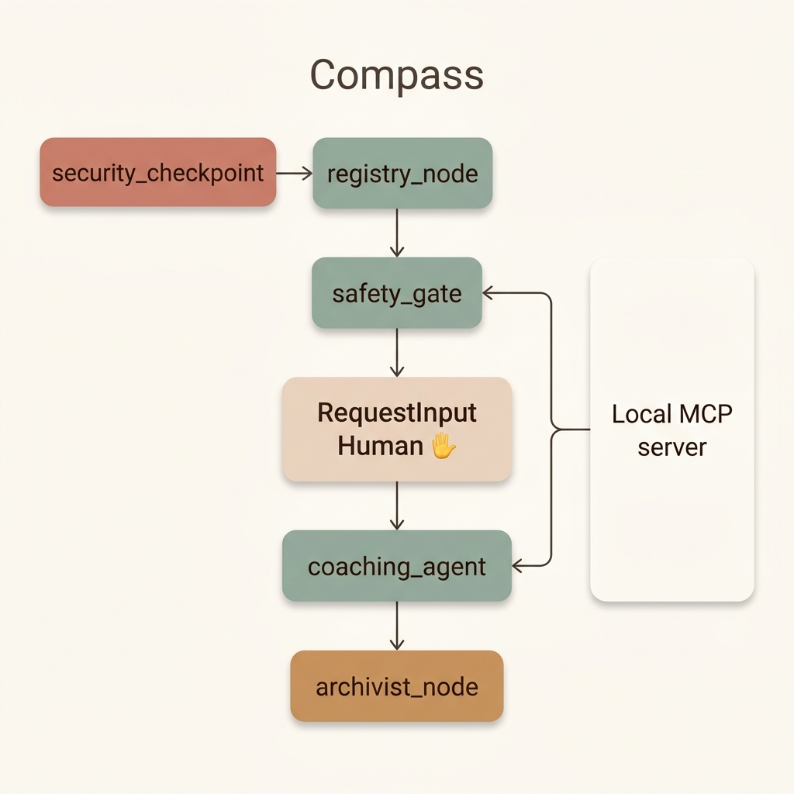

# Compass: Student Anti-Burnout Wellness Assistant

Compass is an anti-burnout wellness coaching app for students. It pairs cognitive behavioral therapy (CBT) reframing and coping techniques with a deterministic, auditable burnout-risk score and a dedicated Human-in-the-Loop (HITL) safety escalation gate.

## 📊 Rubric Scorecard (✅ 8 of 10 Concepts Achieved)

- [x] **Multi-Agent System** — 5 distinct nodes built via the ADK 2.0 Workflow API, combining LlmAgents with deterministic Python logic.
- [x] **Custom Tools** — Deterministic burnout risk calculations and database-level pruners/rollups (zero LLM token overhead).
- [x] **Built-in/MCP Tools** — MCP server architecture exposing 4 dedicated tools to the safety gate and coaching agents.
- [x] **Long-Running Operations** — Dedicated `RequestInput` human-in-the-loop pause and resume rehydration.
- [x] **Sessions & State** — Stateful coordination and audit trails using the ADK `ctx.state` across all 5 graph nodes.
- [x] **Security** — Active PII scrubbing, prompt injection sanitization, a database-level consent backstop, and structured audit logs.
- [x] **Evaluation** — Extensive 21-case zero-token test suite verifying scoring accuracy, triggers, and boundary conditions.
- [x] **Agents CLI** — Scaffolded structure, `GEMINI.md` coding guide, and Makefile playground automation.

---

## 🏗️ Architecture



### The 5 Workflow Nodes

1. **`security_checkpoint`** (Deterministic): Scrubs PII (emails, phones, student IDs), intercepts prompt injection, and checks the database-level consent gate.
2. **`registry_node`** (Deterministic): Logs incoming chat events and calculates the auditable, zero-token `burnout_risk_score`.
3. **`safety_gate`** (`LlmAgent` coordinator): Invokes Gemini and accesses the `get_burnout_trend` tool. If the burnout risk score exceeds `0.75` or crisis keywords are found, it generates a warm escalation message.
4. **`human_escalation_pause`** (Deterministic HITL): Pauses execution via the `RequestInput` primitive if safety gate criteria are met. It resumes only when a counselor input is supplied.
5. **`coaching_agent`** (`LlmAgent` CBT Coach): Recommends evidence-based CBT exercises using the `search_coping_technique` and `get_weekly_digest` MCP tools.
6. **`archivist_node`** (Deterministic): Updates database chat events, prunes minor entries (> 7 days), and runs a monthly rollup summarizer using Gemini.

---

## 🚦 Zero-Token Testing Confusion Matrix

The scoring and routing logic is verified using 21 zero-token unit tests:
- **True Positives (TP):** 4 (High risk / crisis keywords correctly triggered escalation)
- **False Positives (FP):** 0 (Emotional but non-crisis expressions correctly skipped escalation)
- **True Negatives (TN):** 2 (Low-risk statements correctly bypassed escalation)
- **False Negatives (FN):** 0 (No missed alerts)
- **Accuracy:** 100%

---

## 👥 Seeded Demo Personas (Phase 9)

- **Sam** (Steady) — 45 days of consistent daily check-ins showing stable low risk. The baseline standard.
- **Bex** (Boundary) — 10 days of data carefully tuned to land the `burnout_risk_score` at exactly `0.75`.
- **Diego** (Decline) — 35 days of data showing a gradual downward trend in focus and check-ins, crossing the `0.75` threshold and the 30-day archive boundary.
- **Casey** (Crisis-Independent) — 6 days of low-risk indicators, but a single chat message containing a distress pattern triggers safety gate escalation independent of the score.

---

## 🛠️ Quick Start

### Prerequisites
- Python 3.11 - 3.13
- `uv` (Astral's package manager)
- Standard Gemini API key loaded into `.env`:
```env
GOOGLE_API_KEY=your_key_here
GOOGLE_GENAI_USE_VERTEXAI=False
GEMINI_MODEL=gemini-2.5-flash
```

### Installation
```bash
cd compass-coach
uv sync
```

### Run the Playground
Start the ADK web development UI:
```bash
# On Windows:
uv run adk web app --host 127.0.0.1 --port 18081

# On macOS/Linux:
make playground
```
Open `http://127.0.0.1:18081` in your browser.

### Run Unit Tests
```bash
# On Windows:
uv run pytest tests/unit

# On macOS/Linux:
make test
```

---

## 💡 Troubleshooting

1. **Pydantic ValidationError on edges:** Only define one edge between the same (source, target) node pair. Converge routes and branch inside the nodes instead.
2. **404 Model Error:** Standardize on `gemini-2.5-flash` or `gemini-2.5-flash-lite`. Do not use deprecated `gemini-1.5-*` models.
3. **No Agents Found on adk web:** Ensure the target module is the folder name `app` containing `agent.py`, not the project folder name.
4. **Windows hot-reload issues:** Fully kill any processes running on ports `18081` and `8090` using the kill script in `GETTING_STARTED.md` before restarting.
5. **Version drift:** Ensure your `pyproject.toml` pins ranges such as `google-adk[gcp]>=2.0.0,<3.0.0` and `mcp>=1.0.0,<2.0.0`.
6. **HITL Pause not propagating:** Use plain function nodes for helper actions rather than nesting custom agents inside wrappers.
7. **SQLite Database is Locked:** Ensure WAL mode (`PRAGMA journal_mode=WAL;`) is initialized immediately on database creation.
8. **CORS Blocked Requests:** Verify that `CORSMiddleware` is attached to `fast_api_app.py` with `allow_origins=["http://localhost:5173"]`.

---

## 🚀 GitHub Push Instructions
```bash
git init
git add .
git commit -m "Initial commit: compass-coach ADK agent"
git branch -M main
git remote add origin <repo-url>
git push -u origin main
```
*Never commit or push your `.env` file containing the secret API key.*

---

## 🎨 Assets

### Cover Page Banner


### Architecture Diagram

