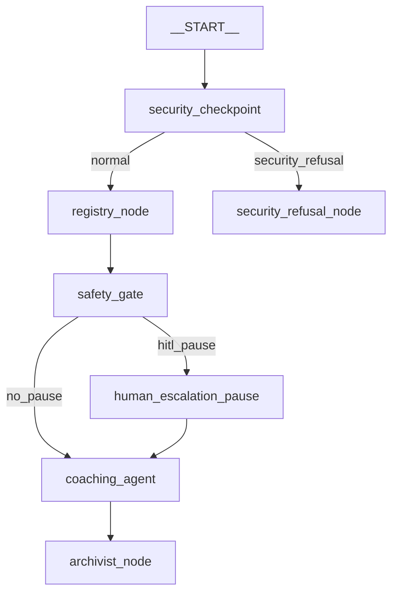

# Compass Coach: Submission Write-Up

## 1. Problem Statement
Academic burnout is an escalating crisis in higher education. Studies estimate that between **35% and 52% of university students** experience significant burnout symptoms at some point during their studies. Generic journal apps and basic AI chatbots lack safety rails and clinical boundaries. Compass addresses this by pairing cognitive behavioral therapy (CBT) coaching with a deterministic risk scoring engine and a dedicated human-in-the-loop (HITL) safety gate, protecting students while ensuring professional support is always accessible when needed.

---

## 2. System Architecture
The application runs as a graph-based workflow using the ADK 2.0 Workflow API:

- **[security_checkpoint](file:///c:/Users/KIIT/OneDrive/Desktop/adk-workspace/compass-coach/app/agent.py#L43)**: Deterministic PII scrub, injection check, and consent verification.
- **[registry_node](file:///c:/Users/KIIT/OneDrive/Desktop/adk-workspace/compass-coach/app/agent.py#L112)**: Persists check-in/timer events and computes the `burnout_risk_score`.
- **[safety_gate](file:///c:/Users/KIIT/OneDrive/Desktop/adk-workspace/compass-coach/app/agent.py#L201)**: Coordinates LLM checks and triggers human-escalation pauses.
- **[human_escalation_pause](file:///c:/Users/KIIT/OneDrive/Desktop/adk-workspace/compass-coach/app/agent.py#L237)**: Interrupts workflow execution using the `RequestInput` HITL primitive.
- **[coaching_agent](file:///c:/Users/KIIT/OneDrive/Desktop/adk-workspace/compass-coach/app/agent.py#L257)**: Suggests CBT exercises using MCP tools.
- **[archivist_node](file:///c:/Users/KIIT/OneDrive/Desktop/adk-workspace/compass-coach/app/agent.py#L276)**: Manages SQLite database pruning and monthly LLM rollup summaries.

---

## 3. Human-in-the-Loop (HITL) Flow
The safety mechanism is designed with a graph-level guarantee: **the coaching agent is never exposed to crisis-flagged inputs before a human pause is resolved.**

Two independent triggers converge on the same `RequestInput` pause:
1. **Deterministic Score Threshold:** A `burnout_risk_score` exceeding `0.75` (calculated by combining missed check-in streaks, decline in study focus timer logs, negative affect frequency, and checklist completion ratios).
2. **Crisis Keyword Flag:** Immediate pattern matching on distress expressions (e.g., hopelessness, self-harm keywords).

If either trigger is tripped, the safety gate routes execution to `human_escalation_pause`, which yields a `RequestInput` action. The execution suspends until a counselor or supervisor provides a response, which is then recorded in `ctx.state` before routing the clean flow to the coaching agent.

---

## 4. Security Design
- **PII Redaction:** A regex pipeline in the first node scrubs emails, phone numbers, and student IDs from the user's input before database logging or LLM transmission.
- **Prompt Injection Defense:** Blocks common injection heuristics, intercepting requests and routing them to a neutral refusal terminal node.
- **Technical Consent Gate:** Enforced at the tool query layer. If `digital_wellbeing_permitted` is marked False in the database, the `get_burnout_trend` tool refuses to return activity metrics, acting as a technical backstop.
- **Structured Audit Logging:** Every request yields a structured JSON audit line detailing safety assessments and data redactions.

---

## 5. MCP Tool Design
The Model Context Protocol (MCP) server runs locally and exposes four tools:
- `log_checkin`: Persists check-in metrics.
- `get_burnout_trend`: Returns historical scores (blocked if consent is disabled).
- `search_coping_technique`: Returns evidence-grounded CBT instructions (local database search).
- `get_weekly_digest`: Pulls historical weekly/monthly rollups.

---

## 6. Clinical Limitations Warning

> [!IMPORTANT]
> **Compass is a pattern detection and self-directed coaching tool, NOT a diagnostic app.** It does not diagnose clinical conditions. Any indications of high risk, severe burnout, or personal crisis are immediately routed to a human counselor or support representative.

---

## 7. Demo Walkthrough
1. **Sam (Steady):** Shows how the system stays quiet and provides normal CBT coaching when indicators are positive.
2. **Bex (Boundary):** Demonstrates precision routing at the exact `0.75` score threshold.
3. **Diego (Decline):** Illustrates the 30-day rollup archiver summarizing a downward slope in study focus.
4. **Casey (Crisis):** Demonstrates that crisis keywords trigger human-escalation pauses instantly, regardless of the burnout score.
